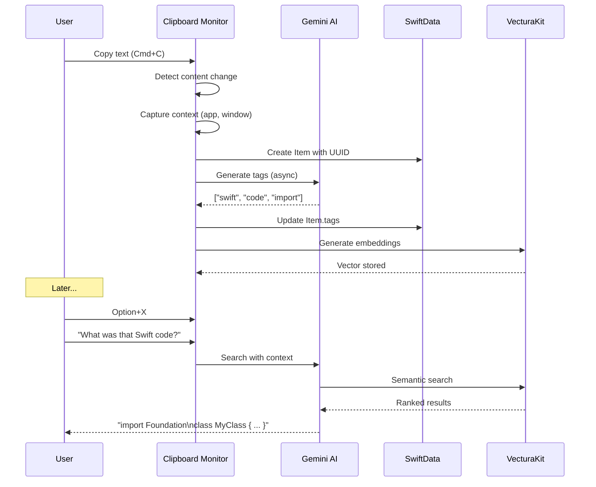

<div align="center">

# 📎 Clippy - AI-Powered Clipboard Manager

[](https://github.com/yhinai/clippy)
[](https://www.apple.com/macos/)
[](https://swift.org/)
[](https://developer.apple.com/xcode/swiftui/)
[](https://opensource.org/licenses/MIT)

---

### 🎯 Your Nostalgic AI Assistant is Back!

### Smart Clipboard Management with Context-Aware Intelligence

[](https://github.com/yhinai/clippy)
[](https://clippy-website.vercel.app)
[](https://youtu.be/G7C_tThwl9s)


[](https://trae.ai)

</div>

---

## Table of Contents

- [Overview](#overview)
- [Key Features](#key-features)
- [Technology Stack](#technology-stack)
- [Architecture](#architecture)
- [Quick Start](#quick-start)
- [How It Works](#how-it-works)
- [Keyboard Shortcuts](#keyboard-shortcuts)
- [AI Services](#ai-services)
- [Privacy & Security](#privacy--security)
- [Performance](#performance)
- [System Requirements](#system-requirements)
- [Contributing](#contributing)
- [License](#license)

---

## Overview

**Clippy** brings back the beloved Microsoft Office assistant into the modern age with AI-powered intelligence! This isn't just another clipboard manager—it's your smart companion that understands context, learns from your workflow, and magically finds exactly what you need from your clipboard history.

### 🎬 Demo Video

<div align="center">

[](https://youtu.be/G7C_tThwl9s)

**See Clippy in action!** Watch our video demonstration to see how AI-powered clipboard management works.

</div>

### Value Proposition

<div align="center">

| Feature | Capability | Badge |
|---------|------------|-------|
| **AI Context Awareness** | Semantic understanding |  |
| **Natural Language** | Ask questions naturally |  |
| **Visual Intelligence** | Image analysis & OCR |  |
| **Privacy First** | Local AI option |  |
| **OS Integration** | macOS optimized |  |
| **Semantic Search** | Vector embeddings |  |

</div>

### What Makes Clippy Special?

🎯 **Context-Aware**: Understands what you're doing using macOS Accessibility APIs  
🧠 **AI-Powered**: Uses Gemini 3 Pro for semantic tagging and intelligent search  
🖼️ **Visual Intelligence**: Analyzes images with Apple Vision Framework  
🔒 **Privacy-Focused**: Option to run completely local with Qwen3-4b  
📎 **Floating Assistant**: Nostalgic Clippy character that follows your cursor  
⚡ **Instant Answers**: Type a question, get instant answers from your clipboard history  

---

## Key Features

### 🎨 Intelligent Clipboard Management

<table>
<tr>
<td width="50%">

#### Core Features

- **📋 Unlimited History** - Never lose clipboard data again
- **🏷️ Auto-Tagging** - AI generates semantic tags automatically
- **🔍 Smart Search** - Find items by meaning, not just keywords
- **📸 Image Support** - Store and search screenshots with AI descriptions
- **⭐ Favorites** - Mark important items for quick access
- **📂 Category Filtering** - Filter by type (text, code, images)

</td>
<td width="50%">

#### Technologies

[](https://swift.org)
[](https://developer.apple.com/xcode/swiftui/)
[](https://developer.apple.com/xcode/swiftdata/)
[](https://ai.google.dev/)
[](https://developer.apple.com/documentation/vision)

</td>
</tr>
</table>

### 🤖 AI-Powered Capabilities

<div align="center">

[](https://ai.google.dev/)

</div>

- **Natural Language Queries** - "What was that tracking number?" → Get instant answers
- **Semantic Tagging** - Auto-generates contextual tags like ["swift", "code", "import"]
- **Smart Image Analysis** - "Screenshot of code editor showing Swift class"
- **Context Understanding** - Knows which app you're in and what you're doing
- **Intelligent Ranking** - Combines vector similarity, recency, and usage frequency
- **Question Answering** - Ask about your clipboard history in plain English

### 📎 The Floating Clippy Assistant

<div align="center">


</div>

- **Floating Window** - Follows your cursor and text input
- **Animated States** - 23 different GIF animations
- **Speech Bubbles** - Friendly feedback and tips
- **Non-Intrusive** - Press ESC to dismiss anytime
- **Smart Positioning** - Avoids notch and screen edges
- **Always Available** - Visible across all desktops and fullscreen apps

---

## Technology Stack

<div align="center">

### Core Technologies

[](https://apple.com)
[](https://swift.org)
[](https://developer.apple.com/xcode/swiftui/)
[](https://developer.apple.com/xcode/swiftdata/)

### AI & Machine Learning

[](https://ai.google.dev/)
[](https://huggingface.co/)
[](https://github.com/VecturaMLX)
[](https://developer.apple.com/vision/)

### macOS Integration

[](https://developer.apple.com/documentation/appkit)
[](https://developer.apple.com/accessibility/)
[](https://developer.apple.com/documentation/coregraphics)

### Development Tools

[](https://trae.ai)
[](https://developer.apple.com/xcode/)

</div>

---

## Architecture

### System Design

```
┌──────────────────────────────────────────────────────────────────┐
│                         USER INTERFACE                           │
│  ┌────────────────────────────────────────────────────────────┐  │
│  │  ContentView | ClipboardListView | ClipboardDetailView     │  │
│  │  FloatingDogWindow | SpeechBubble | ClippySpriteView       │  │
│  └────────────────────────────────────────────────────────────┘  │
└──────────────────────────────────────────────────────────────────┘
                                 │
                                 ▼
┌──────────────────────────────────────────────────────────────────┐
│                     CONTROL LAYER                                │
│  ┌────────────────────────────────────────────────────────────┐  │
│  │  HotkeyManager | TextCaptureService | VisionScreenParser   │  │
│  │  (Option+X/V/S)  (AI Text Replace)   (OCR & Analysis)      │  │
│  └────────────────────────────────────────────────────────────┘  │
└──────────────────────────────────────────────────────────────────┘
                                 │
        ┌────────────────────────┼────────────────────────┐
        ▼                        ▼                        ▼
┌──────────────┐       ┌──────────────────┐      ┌──────────────┐
│   Clipboard  │       │   Suggestion     │      │   Clipboard  │
│    Monitor   │       │     Engine       │      │    Service   │
│(NSPasteboard)│       │  (AI Ranking)    │      │  (CRUD Ops)  │
└──────┬───────┘       └────────┬─────────┘      └───────┬──────┘
       │                        │                        │
       └────────────────────────┼────────────────────────┘
                                ▼
┌────────────────────────────────────────────────────────────────┐
│                      AI SERVICES LAYER                         │
│                                                                │
│  ┌──────────────────┐  ┌──────────────────┐  ┌──────────────┐  │
│  │  Gemini 3 Pro    │  │  Qwen3-4b Local  │  │  Embedding   │  │
│  │  (Primary AI)    │  │  (Privacy Mode)  │  │   Service    │  │
│  │  - Tagging       │  │  - Local Tagging │  │  - VecturaKit│  │
│  │  - Q&A           │  │  - Local Q&A     │  │  - Qwen3-    │  │
│  │  - Analysis      │  │  - No Cloud      │  │    Embedding │  │
│  └──────────────────┘  └──────────────────┘  └──────────────┘  │
└────────────────────────────────────────────────────────────────┘
                                 │
                                 ▼
┌─────────────────────────────────────────────────────────────────┐
│                       DATA LAYER                                │
│                                                                 │
│  ┌────────────────────────────────────────────────────────────┐ │
│  │              SwiftData (Item Model)                        │ │
│  │  - timestamp, content, appName, contentType                │ │
│  │  - usageCount, vectorId, tags, imagePath, isFavorite       │ │
│  └────────────────────────────────────────────────────────────┘ │
│                                                                 │
│  ┌────────────────────────────────────────────────────────────┐ │
│  │          VecturaMLXKit (Vector Database)                   │ │
│  │  - Semantic embeddings (768 dimensions)                    │ │
│  │  - Cosine similarity search                                │ │
│  │  - Qwen3-Embedding-0.6B model                              │ │
│  └────────────────────────────────────────────────────────────┘ │
└─────────────────────────────────────────────────────────────────┘
```

### Data Flow Pipeline

1. **Monitor** → Track clipboard changes every 0.5 seconds
2. **Capture** → Grab content + context (app, window, accessibility info)
3. **Process** → AI generates semantic tags and embeddings
4. **Store** → Save to SwiftData with vector index
5. **Search** → Intelligent ranking by semantic similarity
6. **Assist** → Floating Clippy provides contextual help

---

## Quick Start

### Prerequisites


### Installation Steps

```bash
# Clone the repository
git clone https://github.com/yhinai/clippy.git
cd clippy

# Open in Xcode
open Clippy.xcodeproj

# Build and run
# Press Cmd+R or click the Play button in Xcode
```

### First Launch

1. **Enable Accessibility** - System Settings → Privacy & Security → Accessibility
2. **Add API Key** - Configure Gemini 3 Pro or install LM Studio for local AI
3. **Start Copying** - Use `Option+X` to ask questions about your clipboard

---

## How It Works

### 🔄 Copy → Tag → Store → Search



### 🎯 Natural Language Magic

**Workflow:**

1. Press `Option+X` to start capturing
2. Type your question: "tracking number"
3. Press `Option+X` again
4. Clippy searches your history with AI
5. Your typed text is **deleted**
6. The answer appears **in place**!

**Example:**

```
You type: "tracking number"
         ↓
AI finds: "1ZAC65432428054431" (from 2 hours ago)
         ↓
Result: Your text replaced with answer automatically!
```

---

## Keyboard Shortcuts

| Shortcut | Action | Description |
|----------|--------|-------------|
| **Option+X** | 🎙️ Toggle Text Capture | Start/stop capturing text for AI queries |
| **Option+V** | 📸 Parse Screen | Use Vision to extract text from screen |
| **Option+S** | 💡 Show Suggestions | Display clipboard suggestions |
| **ESC** | ❌ Dismiss Clippy | Hide the floating assistant |
| **Cmd+C** | 📋 Copy | Automatically tracked by Clippy |

---

## AI Services

### 🌐 Gemini 3 Pro (Primary AI)

<div align="center">

[](https://ai.google.dev/)

</div>

**Features:**
- ✅ Semantic tagging with high accuracy
- ✅ Natural language understanding
- ✅ Image analysis and description
- ✅ Fast response times
- ✅ Context-aware answers

**Use Cases:**
- Generating semantic tags
- Answering clipboard questions
- Analyzing images and screenshots
- Understanding code snippets

### 🔒 Qwen3-4b (Local AI)

<div align="center">

[](https://huggingface.co/)

</div>

**Features:**
- ✅ Complete privacy (no cloud)
- ✅ No API costs
- ✅ Works offline
- ✅ Same features as Gemini
- ❌ Slower inference
- ❌ Lower accuracy on complex tasks

**Setup:**
1. Install [LM Studio](https://lmstudio.ai/)
2. Download Qwen3-4b model
3. Start local server (port 1234)
4. Toggle "Local AI" in Clippy settings

---

## Privacy & Security

<div align="center">

[](https://github.com/yhinai/clippy)

</div>

### 🔐 Security Features

- **Local-First** - All clipboard data stored locally
- **No Telemetry** - Zero analytics or tracking
- **Encrypted Storage** - SwiftData with encryption
- **Optional Cloud** - Choose between cloud AI or local AI
- **Accessibility Only** - Minimal system permissions required
- **Open Source** - Full transparency

### 🛡️ Privacy Modes

**Cloud Mode (Gemini 3 Pro)**
- Data sent to Google AI for processing
- Encrypted in transit (HTTPS/TLS)
- Subject to Google's privacy policy
- Better accuracy and speed

**Local Mode (Qwen3-4b)**
- **100% private** - No data leaves your device
- All AI processing on local network
- Complete control over your data
- Recommended for sensitive content

### 📋 Permissions Required

| Permission | Purpose | Required? |
|-----------|---------|-----------|
| **Accessibility** | Clipboard monitoring, context capture, hotkeys | ✅ Yes |
| **Screen Recording** | OCR and screen text parsing | ⚠️ Optional |
| **Network** | Cloud AI features | ⚠️ Optional |

---

## Performance

<div align="center">

### System Performance

| Metric | Value | Badge |
|--------|-------|-------|
| **Clipboard Detection** | < 500ms |  |
| **AI Tagging** | 1-3s async |  |
| **Search Query** | < 100ms |  |
| **Memory Usage** | ~50MB average |  |
| **CPU Usage** | < 5% idle |  |
| **Storage** | ~10MB + images |  |

</div>

### ⚡ Performance Optimizations

- **Async/Await** - Non-blocking AI operations
- **Smart Filtering** - Deduplication and noise reduction
- **Incremental Updates** - Only new items processed
- **Vector Caching** - Embeddings cached for fast search
- **Lazy Loading** - Images loaded on demand
- **Timer Optimization** - 0.5s polling with minimal overhead

---

## System Requirements

<div align="center">

### Minimum Requirements

[](https://apple.com)
[](https://apple.com)
[](https://apple.com)

</div>

**Hardware:**
- Apple Silicon (M1/M2/M3) or Intel (2018+)
- 8GB RAM (16GB recommended for local AI)
- 100MB free storage (+ images)
- Internet connection (for cloud AI)

**Software:**
- macOS 15.0 (Sonoma) or later
- Xcode 16.0+ (for building)
- Swift 5.0+
- Accessibility permissions

**Optional:**
- LM Studio (for local AI)
- Gemini API key (for cloud AI)

---

## Project Structure

```
Clippy/
├── App/                    # Entry point
│   └── ClippyApp.swift
├── Services/               # All business logic (15 files)
│   ├── AppDependencyContainer.swift
│   ├── Models.swift
│   ├── ClipboardMonitor.swift  # + ClipboardService
│   ├── ClipboardRepository.swift
│   ├── ContextEngine.swift
│   ├── GeminiService.swift
│   ├── LocalAIService.swift    # Native MLXLLM
│   ├── ElevenLabsService.swift # + AudioRecorder
│   ├── HotkeyManager.swift
│   ├── TextCaptureService.swift
│   └── VisionScreenParser.swift
├── UI/                     # All views (5 files)
│   ├── ContentView.swift
│   ├── ClipboardListView.swift
│   ├── ClipboardDetailView.swift  # + FlowLayout
│   ├── ClippyWindowController.swift # + ClippyGifPlayer
│   └── SidebarView.swift
└── Resources/              # GIF animations
```

**8 directories, 28 files, ~5,100 lines**


---

## Contributing

[](https://github.com/yhinai/clippy)

We welcome contributions! Here's how to get started:

### Development Workflow

```bash
# Fork and clone
git clone https://github.com/YOUR_USERNAME/clippy.git
cd clippy

# Create feature branch
git checkout -b feature/amazing-feature

# Make changes and test
open Clippy.xcodeproj
# Make your changes in Xcode

# Commit changes
git commit -m "feat: add amazing feature"

# Push and create PR
git push origin feature/amazing-feature
```

### Contribution Guidelines

- Follow Swift style guide
- Add tests for new features
- Update documentation
- Keep PRs focused and small
- Write descriptive commit messages

---

## Roadmap

### 🚀 Upcoming Features

- [ ] **iCloud Sync** - Sync clipboard across devices
- [ ] **Collections** - Organize items into folders
- [ ] **Export/Import** - Backup clipboard history
- [ ] **Snippets** - Text expansion templates
- [ ] **Shortcuts Integration** - macOS Shortcuts actions
- [ ] **Drag & Drop** - Drag items to other apps
- [ ] **Themes** - Customize Clippy appearance
- [ ] **Plugins** - Third-party integrations

---

## License

[](https://opensource.org/licenses/MIT)

This project is licensed under the MIT License - see the [LICENSE](LICENSE) file for details.

---

## Acknowledgments

<div align="center">

Special thanks to:

[](https://developer.apple.com)
[](https://ai.google.dev/)
[](https://github.com/VecturaMLX)
[](https://microsoft.com)
[](https://trae.ai)

### 🛠️ Built with TRAE IDE - The AI-Powered Development Environment

</div>

---

## Screenshots & Demo

<div align="center">

### 🎬 Watch the Full Demo

[](https://youtu.be/G7C_tThwl9s)

**Click above to see Clippy in action!**

See how AI-powered clipboard management transforms your workflow with natural language queries, smart tagging, and the nostalgic Clippy assistant.

</div>

---

## Contact & Support

<div align="center">

[](https://github.com/yhinai/clippy/issues)
[](https://github.com/yhinai/clippy/discussions)
[](https://github.com/yhinai/clippy#readme)

---

### Built with ❤️ and nostalgia using TRAE IDE

**Clippy is back, and he's smarter than ever!**


**Powered by macOS | Gemini 3 Pro | Apple Vision | TRAE IDE**

[](https://github.com/yhinai/clippy#readme)

</div>

